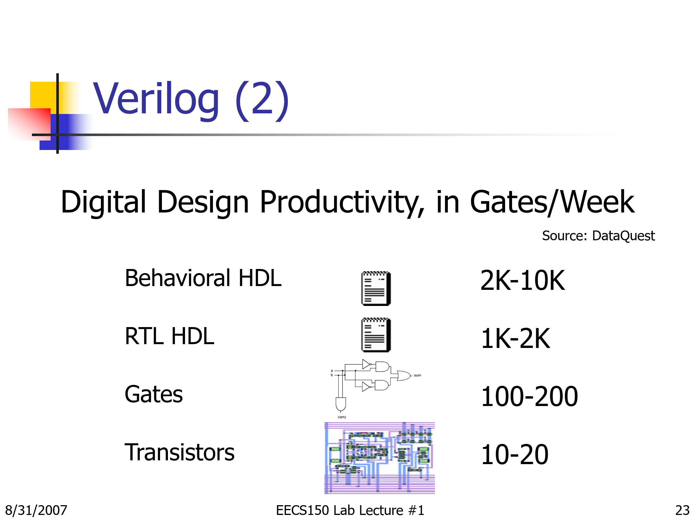

# Verilog Playground

## Setup:
* linux x2go (xcfe)

## Some resources:
* when installing modelsim: do not install in root!
* when installing, you need to chmod +x the .run file before running it (https://askubuntu.com/questions/18747/how-do-i-install-run-files)
* Changing modelsim font size: https://stackoverflow.com/questions/31555431/the-font-of-my-modelsim-is-too-small-to-see
* to run: <install dir>/intelFPGA_pro/24.1/questa_fse/bin
    * run ./vsim
* https://www.reddit.com/r/FPGA/comments/rxmbwk/need_help_to_run_some_simulations_in_intel/

* using modelsim: https://www.youtube.com/watch?v=9mpRF6bAY1g
* installing modelsim: https://www.youtube.com/watch?v=eOWBF4kNM8w

## types of verilog simulators (to run verilog):
* cycle-based: 
    * ex: verilator
    * https://itsembedded.com/dhd/verilator_1/
* event-based:
    * ex: modelsim
* the difference: https://verificationacademy.com/forums/t/cycle-based-vs-event-based-simulators/31301 || https://www.edn.com/edn-access-07-04-96-digital-logic-simulation-event-driven-cycle-based-and-home-brewe/

https://fpgasoftware.intel.com/

## resources to learn:

https://hdlbits.01xz.net/wiki/Main_Page

https://www.chipverify.com/systemverilog/systemverilog-tutorial
https://verificationguide.com/systemverilog/systemverilog-assertions-sva/

https://www.reddit.com/r/FPGA/comments/suc289/how_can_i_properly_learn_system_verilog/

## getting modelsim to work:
https://www.youtube.com/watch?v=9mpRF6bAY1g&t=2s
https://www.youtube.com/watch?v=eOWBF4kNM8w&t=352s

## Verilog levels:
* 
(https://inst.eecs.berkeley.edu/~cs150/fa07/Calendar.php) lab lecture 1 ppt
https://stackoverflow.com/questions/29815188/difference-between-behavioral-rtl-and-gate-level
https://electronics.stackexchange.com/questions/69022/rtl-vs-hdl-whats-the-difference